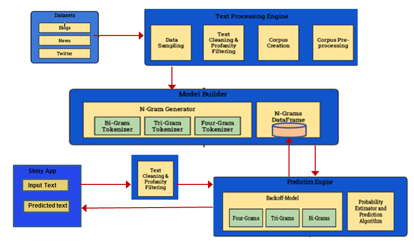

## Architecture

The System Architecture of Word Predictor app have the following main components:

- **Datasets** - The dataset contains text files of news,blog entires ,twitter in English from [HC Corpora](http://www.corpora.heliohost.org/).

- **Text Processing Engine** - Deals with text cleaning(removing ASCII,whitespace,numbers),text pre-processing (convert to lower case), profanity filtering and corpus creation. 

- **Model Builder** - Uses n-gram tokenizers for n(2,3,4) to build n-grams and store them as data frames.For more details on dataset ,Text Processing and Model buider of n-gram tokenizer refer to [Report](https://rpubs.com/NarayananAmudha/161421). 

- **Prediction Engine** - Uses data frames of Model buider and a Backoff Model with probability estimators to predict the top next words list .For more details refer to section **Algorithms**.

- **Shiny App** - Invoke Prediction Engine with Input Text and display the list of top predicted words/phrases predicted through Prediction Engine

    
### Component Diagram 
    

### Prediction Engine Algorithm

The prediction algorithm uses a table (an R 'data.table') of 4grams with frequencies of occurrence. (In Natural Linguistic Processing, a 4gram is a string of 4 words.) The simple explanation is that we look at the last three words of the input, search for a 4gram that begins with those three words in order, and return the 4th word. The actual algorithm has some additional features:

- The data.table has a column for each of the four words in the 4gram (w1, w2, w3, & w4), so we can compare the input phrase (just the last 3 words, actually) to any combination of the words in the table. Here's how we do that:

- Check the input for 1, 2, or 3+ words.
    - If there is only 1 word, compare that to all subsequent words in the table. That is, find the input word in w1 and return the top frequencies for w2. Then find the input word in w2 and return the top frequencies for w3. Then do the same for w3 with w4. 
    - If there are 2 words, compare that bigram to w1:w2 and return the frequencies for w3. Then do that for w2:w3, returning w4.
    - If there are 3 or more words, take only the last 3 words, and compare that to w1:w3 and return the frequencies of w4.

- Use a back-off strategy 
    - If the trigram prediction returns 0, back off to a bigram prediction
    - If the bigram prediction returns 0, then back off to a unigram prediction.